# DrLeeGPT: Complete Functionality Documentation

## 🎯 Executive Summary

DrLeeGPT is an advanced AI teaching assistant built on learning science principles, featuring real-time analytics, intelligent session management, and comprehensive health monitoring. It provides personalized educational experiences through adaptive content delivery, performance tracking, and evidence-based pedagogical strategies.

---

## 🏗️ System Architecture Overview


---

## 🧠 Learning Science Foundation

### Core Educational Philosophy

DrLeeGPT implements evidence-based learning science principles to optimize educational outcomes through:

- **Personalized Learning Paths** - Adaptive content based on individual needs
- **Active Learning Engagement** - Interactive experiences promoting deep understanding
- **Metacognitive Development** - Self-reflection and learning strategy awareness
- **Social Learning Integration** - Collaborative and discussion-based approaches
- **Meaningful Knowledge Construction** - Real-world connections and application

### Learning Principle Detection System


---

## 📊 Analytics & Intelligence Pipeline

### Four-Phase Analytics System


### Learning Analytics Data Flow


---

## 🔄 Session Management & Queue System

### Session Lifecycle Management


### Advanced Queue Processing System

```mermaid
graph TB
    subgraph "Queue Input"
        UserAction[User Actions]
        SessionUpdate[Session Updates]
        MessageSent[Messages Sent]
        Heartbeat[Heartbeat Signals]
    end
    
    subgraph "Queue Processing"
        QueueManager[Queue Manager]
        Batching[Batch Processing]
        RetryLogic[Retry with Backoff]
        OfflineSupport[Offline Persistence]
    end
    
    subgraph "API Layer"
        SingleAPI[/api/sessions]
        BatchAPI[/api/sessions/batch]
        HealthAPI[/api/health]
    end
    
    subgraph "Storage"
        MongoDB[(MongoDB)]
        MemoryQueue[In-Memory Queue]
        ErrorLog[Error Tracking]
    end
    
    UserAction --> QueueManager
    SessionUpdate --> QueueManager
    MessageSent --> QueueManager
    Heartbeat --> QueueManager
    
    QueueManager --> Batching
    Batching --> RetryLogic
    RetryLogic --> OfflineSupport
    
    OfflineSupport --> SingleAPI
    OfflineSupport --> BatchAPI
    
    SingleAPI --> MongoDB
    BatchAPI --> MongoDB
    HealthAPI --> MongoDB
    
    QueueManager --> MemoryQueue
    RetryLogic --> ErrorLog
    
    MongoDB --> QueueManager
    MemoryQueue --> QueueManager
    ErrorLog --> QueueManager
```

### Queue Metrics & Health Monitoring


---

## 🎨 User Interface & Experience

### Multi-Role Interface Design

```mermaid
graph TB
    subgraph "Header Navigation"
        Logo[DrLeeGPT Logo]
        RoleSelector[Role Selection]
        ModeSelector[Learning Mode]
        DebugBtn[Debug Button 🐛]
        HealthBtn[Health Button ❤️‍🩹]
        QueueBtn[Queue Button 📊]
    end
    
    subgraph "Instructor Interface"
        InstTabs[Instructor/Student/About Tabs]
        ChatInterface[Chat Interface]
        PedagogyTools[Pedagogy Tools]
        ContentCreation[Content Creation]
    end
    
    subgraph "Student Interface"
        StudTabs[Learning Tabs]
        SimplifiedChat[Simplified Chat]
        ProgressTracking[Progress Tracking]
        SelfAssessment[Self Assessment]
    end
    
    subgraph "Analytics Displays"
        PhaseAnalytics[4-Phase Analytics]
        PrincipleCards[Learning Principle Cards]
        PerformanceMetrics[Performance Metrics]
        AdaptationIndicators[Adaptation Indicators]
    end
    
    subgraph "Modal Interfaces"
        QueueModal[Queue Metrics Panel]
        HealthModal[Health Monitoring Dashboard]
        DebugModal[Debug Output Console]
        SettingsModal[Settings Configuration]
    end
    
    Logo --> RoleSelector
    RoleSelector --> ModeSelector
    ModeSelector --> DebugBtn
    DebugBtn --> HealthBtn
    HealthBtn --> QueueBtn
    
    RoleSelector --> InstTabs
    RoleSelector --> StudTabs
    
    InstTabs --> ChatInterface
    ChatInterface --> PedagogyTools
    PedagogyTools --> ContentCreation
    
    StudTabs --> SimplifiedChat
    SimplifiedChat --> ProgressTracking
    ProgressTracking --> SelfAssessment
    
    ChatInterface --> PhaseAnalytics
    SimplifiedChat --> PhaseAnalytics
    PhaseAnalytics --> PrincipleCards
    PrincipleCards --> PerformanceMetrics
    PerformanceMetrics --> AdaptationIndicators
    
    QueueBtn --> QueueModal
    HealthBtn --> HealthModal
    DebugBtn --> DebugModal
    ModeSelector --> SettingsModal
```



### Learning Mode Adaptation


---

## 🔍 Advanced Features & Capabilities

### Debugging & Diagnostic System


### Real-time Analytics Processing


---

## 🔧 Technical Implementation Details

### Technology Stack


### Data Models & Schemas


---

## 🚀 Performance & Scalability

### System Performance Metrics


### Error Handling & Recovery


---

## 📈 Analytics & Reporting

### Learning Analytics Dashboard


---

## 🔒 Security & Privacy

### Security Architecture


---

## 🎯 Future Roadmap

### Planned Enhancements

```mermaid
timeline
    title DrLeeGPT Development Roadmap
    
    section Phase 5D: Predictive Analytics
        Predictive Models    : Learning outcome prediction
                            : Risk assessment algorithms
                            : Intervention recommendations
        
        AI Insights         : Pattern recognition
                            : Anomaly detection
                            : Performance forecasting
    
    section Phase 5E: Enterprise Scaling
        Multi-tenant        : Organization isolation
                            : Advanced role management
                            : Institutional analytics
        
        Scaling Infrastructure : Microservices architecture
                               : Load balancing
                               : Global deployment
    
    section Future Innovations
        Advanced AI         : GPT-5 integration
                           : Multimodal learning
                           : Voice interaction
        
        Extended Analytics  : Learning path optimization
                           : Social learning features
                           : Gamification elements
```

---

## 📋 Getting Started

### Quick Start Guide

1. **Installation**
   ```bash
   git clone [repository]
   cd LearningScience.ai
   npm install
   ```

2. **Configuration**
   - Set up MongoDB connection
   - Configure OpenAI API key
   - Set authentication credentials

3. **Development**
   ```bash
   npm run dev
   ```

4. **Testing**
   - Click debug button (🐛) to test all systems
   - Verify session creation and queue processing
   - Check health monitoring dashboard

5. **Production Deployment**
   - Configure production environment
   - Set up monitoring and alerting
   - Deploy with proper security measures

---

## 🤝 Contributing

### Development Guidelines

- Follow TypeScript best practices
- Implement comprehensive error handling
- Add unit tests for new features
- Document all API changes
- Maintain learning science principles
- Ensure accessibility compliance

### Testing Requirements

- Unit tests for all components
- Integration tests for API routes
- End-to-end testing for user workflows
- Performance testing for scalability
- Security testing for vulnerabilities

---

## 📞 Support & Documentation

- **User Guide**: Comprehensive usage instructions
- **API Documentation**: Complete API reference
- **Developer Guide**: Technical implementation details
- **Troubleshooting**: Common issues and solutions
- **Learning Science Resources**: Educational background and research

---

**DrLeeGPT** represents the cutting edge of educational technology, combining proven learning science principles with advanced AI capabilities to create personalized, effective learning experiences for educators and students worldwide.
